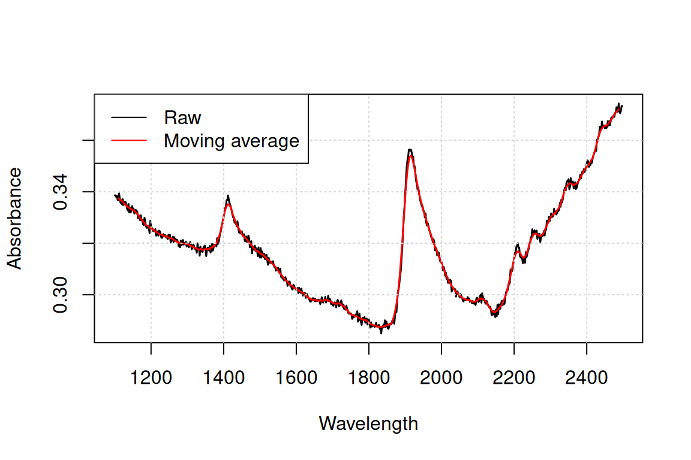
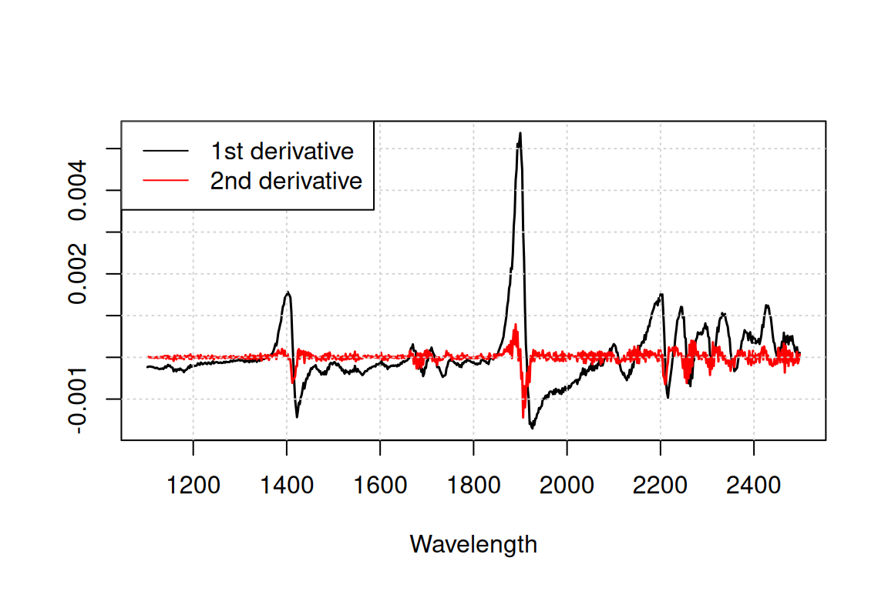
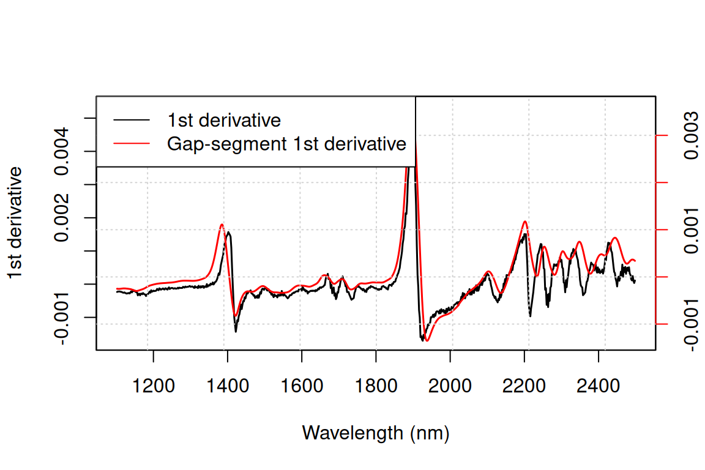
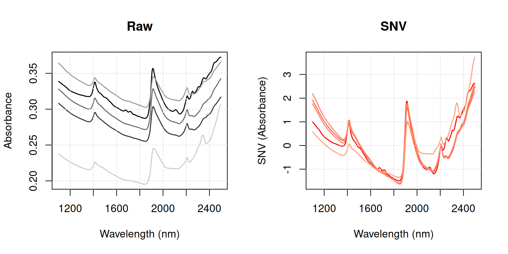
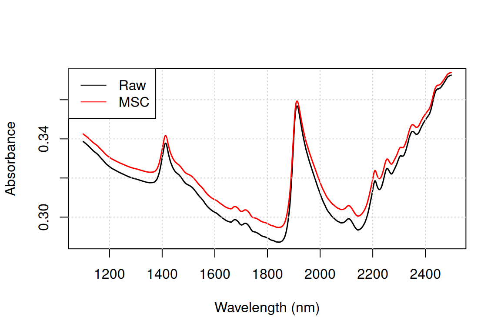
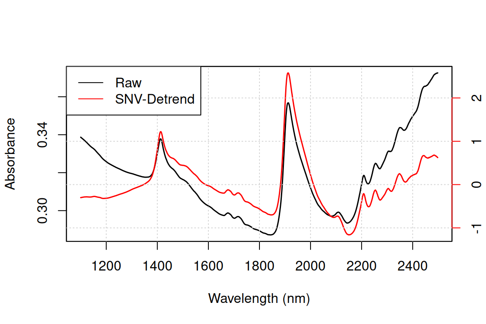
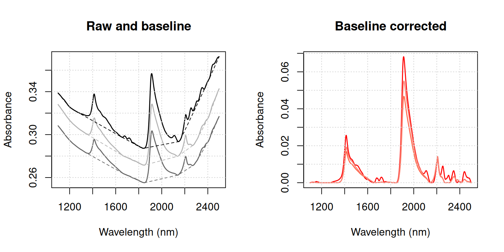
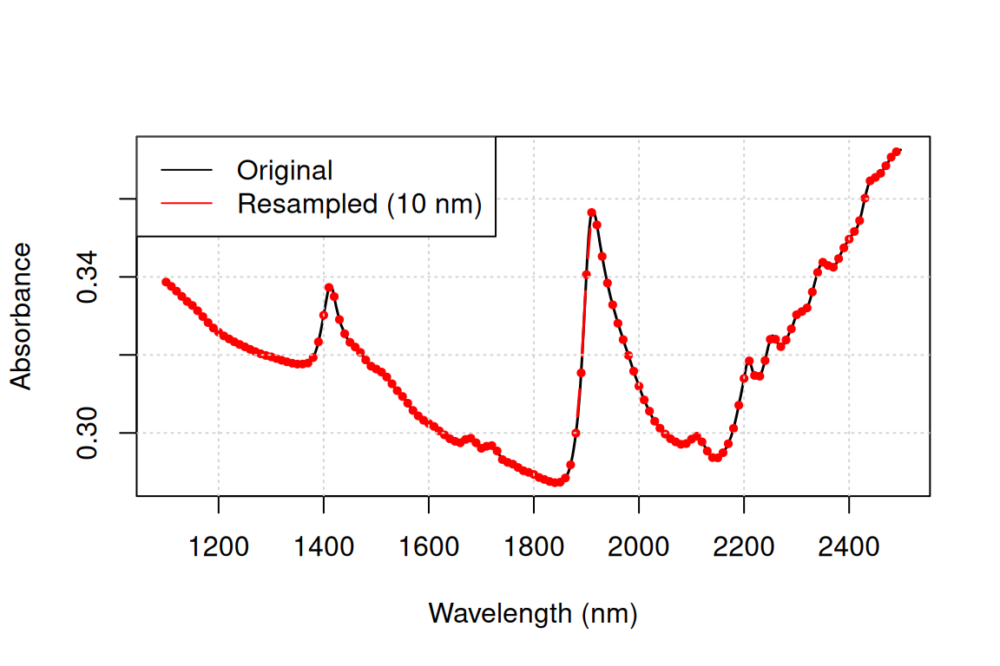
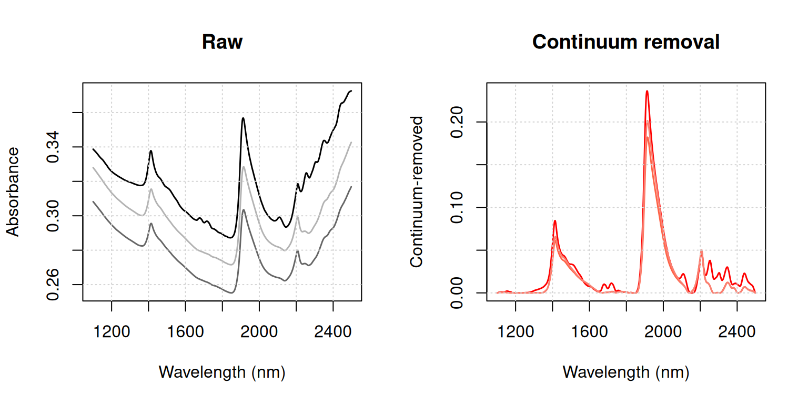

# Pre-processing spectral data

> *Organism is opposed to chaos… as message is to noise.* – ([Wiener,
> 1954](#ref-wiener1954human))


## 1 Introduction

The aim of spectral pre-treatment is to improve signal quality before
modelling as well as remove physical information from the spectra.
Applying a pre-treatment can increase the repeatability/reproducibility
of the method, model robustness and accuracy, although there are no
guarantees this will actually work. The pre-processing functions
currently available in the package are listed in
[Table 1](#tbl-preprocessing).

    [34mprospectr version 0.2.9 -- proxy[39m

    [34mcheck the package repository at: https://github.com/l-ramirez-lopez/prospectr,
    https://l-ramirez-lopez.github.io/prospectr/[39m

| Function                | Description                                      |
|:------------------------|:-------------------------------------------------|
| `movav`                 | Simple moving (or running) average filter        |
| `savitzkyGolay`         | Savitzky–Golay smoothing and derivative          |
| `gapDer`                | Gap–segment derivative                           |
| `baseline`              | Baseline removal (similar to `continuumRemoval`) |
| `continuumRemoval`      | Computes continuum–removed values                |
| `detrend`               | Detrend normalisation                            |
| `standardNormalVariate` | Standard Normal Variate (SNV) transformation     |
| `msc`                   | Multiplicative Scatter Correction                |
| `binning`               | Average a signal in column bins                  |
| `resample`              | Resample a signal to new band positions          |
| `resample2`             | Resample a signal using new FWHM values          |
| `blockScale`            | Block scaling                                    |
| `blockNorm`             | Sum of squares block weighting                   |

Table 1: Pre-processing functions available in the package.

We show below how they can be used, using the Near-Infrared (NIR)
dataset (`NIRsoil`) included in the package ([Fernandez-Pierna and
Dardenne, 2008](#ref-fernandez2008)). Observations should be arranged
row-wise.

``` r

library(prospectr)
data(NIRsoil)
# NIRsoil is a data.frame with 825 observations and 5 variables:
# Nt (Total Nitrogen), Ciso (Carbon), CEC (Cation Exchange Capacity),
# train (0/1 indicator for training (1) and validation (0) samples),
# spc (spectral matrix)
str(NIRsoil)
```

    'data.frame':   825 obs. of  5 variables:
     $ Nt   : num  0.3 0.69 0.71 0.85 NA ...
     $ Ciso : num  0.22 NA NA NA 0.9 NA NA 0.6 NA 1.28 ...
     $ CEC  : num  NA NA NA NA NA NA NA NA NA NA ...
     $ train: num  1 1 1 1 1 1 1 1 1 1 ...
     $ spc  : num [1:825, 1:700] 0.339 0.308 0.328 0.364 0.237 ...
      ..- attr(*, "dimnames")=List of 2
      .. ..$ : chr [1:825] "1" "2" "3" "4" ...
      .. ..$ : chr [1:700] "1100" "1102" "1104" "1106" ...

## 2 Noise removal

Noise represents random fluctuations around the signal that can
originate from the instrument or environmental laboratory conditions.
The simplest solution is to perform $`n`$ repeated measurements and
average the individual spectra; noise decreases by a factor of
$`\sqrt{n}`$. When this is not possible, or if residual noise remains,
it can be removed mathematically.

### 2.1 Moving average

A moving average filter is a column-wise operation that averages
contiguous wavelengths within a given window size, as illustrated in
[Figure 1](#fig-movav).

``` r

# Add some noise
noisy <- NIRsoil$spc + rnorm(length(NIRsoil$spc), 0, 0.001)

# Plot the first spectrum
plot(
  x = as.numeric(colnames(NIRsoil$spc)),
  y = noisy[1, ],
  type = "l",
  lwd = 1.5,
  xlab = "Wavelength",
  ylab = "Absorbance"
)

# Window size of 11 bands; note the 5 first and last bands are lost
X <- movav(X = noisy, w = 11)
lines(x = as.numeric(colnames(X)), y = X[1, ], lwd = 1.5, col = "red")
grid()
legend(
  "topleft",
  legend = c("Raw", "Moving average"),
  lty = 1,
  col = c("black", "red")
)
```



Figure 1: Effect of a moving average with window size of 11 bands on a
raw spectrum.

### 2.2 Savitzky-Golay filtering

Savitzky-Golay filtering ([Savitzky and Golay, 1964](#ref-savitzky1964))
is a widely used pre-processing technique. It fits a local polynomial
regression on the signal and requires **equidistant** bandwidth.
Mathematically, it operates as a weighted sum of neighbouring values:

``` math
x_j^* = \frac{1}{N}\sum_{h=-k}^{k} c_h x_{j+h}
```

where $`x_j^*`$ is the smoothed value, $`N`$ is a normalising
coefficient, $`k`$ is the number of neighbouring values on each side of
$`j`$, and $`c_h`$ are pre-computed coefficients that depend on the
chosen polynomial order, window size, and derivative degree (0 =
smoothing, 1 = first derivative, 2 = second derivative).

``` r

# p = polynomial order
# w = window size (must be odd)
# m = m-th derivative (0 = smoothing)
# Accepts vectors, data frames, or matrices (observations row-wise)
sgvec <- savitzkyGolay(X = NIRsoil$spc[1, ], p = 3, w = 11, m = 0)
sg <- savitzkyGolay(X = NIRsoil$spc, p = 3, w = 11, m = 0)

# Bands at the edges of the spectral matrix are lost
dim(NIRsoil$spc)
```

    [1] 825 700

``` r

dim(sg)
```

    [1] 825 690

## 3 Derivatives

Taking numerical derivatives of the spectra can remove both additive and
multiplicative effects and has further consequences summarised in
[Table 2](#tbl-derivatives).

| Advantage | Drawback |
|:---|:---|
| Reduces baseline offset | Risk of overfitting the calibration model |
| Can resolve overlapping absorptions | Increases noise; smoothing required |
| Compensates for instrumental drift | Increases uncertainty in model coefficients |
| Enhances small spectral absorptions | Complicates spectral interpretation |
| Often increases predictive accuracy for complex datasets | Removes the baseline |

Table 2: Advantages and drawbacks of derivative spectra.

First and second derivatives can be computed with the finite difference
method (difference between two subsequent data points), provided that
bandwidth is constant:

``` math
x_i' = x_i - x_{i-1}
```

``` math
x_i'' = x_{i-1} - 2 \cdot x_i + x_{i+1}
```

In R this can be achieved with the `diff` function from `base`, as shown
in [Figure 2](#fig-derivatives):

``` r

d1 <- t(diff(t(NIRsoil$spc), differences = 1))  # first derivative
d2 <- t(diff(t(NIRsoil$spc), differences = 2))  # second derivative

plot(
  as.numeric(colnames(d1)), d1[1, ],
  type = "l", lwd = 1.5,
  xlab = "Wavelength", ylab = ""
)
lines(as.numeric(colnames(d2)), d2[1, ], lwd = 1.5, col = "red")
grid()
legend(
  "topleft",
  legend = c("1st derivative", "2nd derivative"),
  lty = 1, col = c("black", "red")
)
```



Figure 2: First and second derivatives of a raw spectrum.

Derivatives tend to amplify noise. The gap derivative and the
Savitzky-Golay algorithm both address this. The gap derivative is
computed as:

``` math
x_i' = x_{i+k} - x_{i-k}
```

``` math
x_i'' = x_{i-k} - 2 \cdot x_i + x_{i+k}
```

where $`k`$ is the gap size. This can be achieved using the `lag`
argument of `diff` (see [Figure 3](#fig-gap-derivative)):

``` r

# m = derivative order; w = gap size; s = segment size
gsd1 <- gapDer(X = NIRsoil$spc, m = 1, w = 11, s = 5)

plot(
  as.numeric(colnames(d1)), d1[1, ],
  type = "l", lwd = 1.5,
  xlab = "Wavelength (nm)", ylab = "1st derivative"
)
par(new = TRUE)
plot(
  as.numeric(colnames(gsd1)), gsd1[1, ],
  type = "l", lwd = 1.5, col = "red",
  xaxt = "n", yaxt = "n",
  xlab = "", ylab = ""
)
axis(4, col = "red")
mtext("Gap-segment derivative", side = 4, line = 3, col = "red")
grid()
legend(
  "topleft",
  legend = c("1st derivative", "Gap-segment 1st derivative"),
  lty = 1, col = c("black", "red")
)
par(new = FALSE)
```



Figure 3: Comparison of first derivative (finite difference) and gap
derivative (lag = 10 bands) for the first spectrum.

For greater control over smoothing, the Savitzky-Golay (`savitzkyGolay`)
and gap-segment derivative (`gapDer`) functions are preferable. The
gap-segment algorithm first smooths the signal over a given segment
size, then computes a derivative of a given order over a given gap size.
See Luo et al. ([2005](#ref-luo2005properties)) and Hopkins
([2001](#ref-hopkins2001norris)) for details on these methods.

## 4 Scatter and baseline corrections

Undesired spectral variations due to light *scatter* effects and
variations in effective *path length* can be removed using scatter
corrections.

### 4.1 Standard Normal Variate (SNV)

The *Standard Normal Variate* (SNV) transformation ([Barnes et al.,
1989](#ref-barnes1989)) is a row-wise standardisation that corrects for
light *scatter* by centering and scaling each spectrum individually
([Figure 4](#fig-snv)):

``` math
\text{SNV}_i = \frac{x_i - \bar{x}_i}{s_i}
```

where $`\bar{x}_i`$ is the mean and $`s_i`$ the standard deviation of
the $`i`$-th spectrum (i.e. computed across all bands of that
observation).

``` r

snv <- standardNormalVariate(X = NIRsoil$spc)
wav <- as.numeric(colnames(NIRsoil$spc))

par(mfrow = c(1, 2))

matplot(
  wav, t(NIRsoil$spc[1:5, ]),
  type = "l", lty = 1, lwd = 1.5,
  col = c("black", "grey20", "grey40", "grey60", "grey80"),
  xlab = "Wavelength (nm)", ylab = "Absorbance",
  main = "Raw"
)
grid()

matplot(
  wav, t(snv[1:5, ]),
  type = "l", lty = 1, lwd = 1.5,
  col = c("red", "tomato", "coral", "salmon", "lightsalmon"),
  xlab = "Wavelength (nm)", ylab = "SNV (Absorbance)",
  main = "SNV"
)
grid()

par(mfrow = c(1, 1))
```



Figure 4: Raw absorbance spectra (left) and SNV-transformed spectra
(right) for the first five observations.

According to Fearn ([2008](#ref-fearn2008)), SNV should be applied
*after* filtering (e.g. Savitzky-Golay) rather than before.

### 4.2 Multiplicative Scatter Correction (MSC)

Along with SNV, MSC ([Geladi et al.,
1985](#ref-geladi1985linearization)) is one of the most widely used
pre-processing techniques in NIR spectroscopy ([Rinnan et al.,
2009](#ref-rinnan2009review)). It is a scatter correction method that
accounts for additive and multiplicative effects by regressing each
spectrum ($`x_i`$) against a reference spectrum ($`x_r`$, typically the
mean spectrum, [Figure 5](#fig-msc)):

``` math
x_i = m_i x_r + a_i
```

``` math
\text{MSC}(x_i) = \frac{x_i - a_i}{m_i}
```

where $`a_i`$ and $`m_i`$ are the additive and multiplicative scatter
coefficients, respectively, estimated by ordinary least squares for each
spectrum.

``` r

# Reference spectrum is the column mean of the full matrix
msc_spc <- msc(X = NIRsoil$spc, ref_spectrum = colMeans(NIRsoil$spc))

plot(
  as.numeric(colnames(NIRsoil$spc)), NIRsoil$spc[1, ],
  type = "l", lwd = 1.5,
  xlab = "Wavelength (nm)", ylab = "Absorbance"
)
lines(as.numeric(colnames(msc_spc)), msc_spc[1, ], lwd = 1.5, col = "red")
grid()
legend(
  "topleft",
  legend = c("Raw", "MSC"),
  lty = 1, col = c("black", "red")
)
```



Figure 5: Effect of MSC on a raw spectrum (reference = mean spectrum).

Because MSC correction depends on a reference spectrum, that reference
must be stored and reused when processing new spectra. The following
example shows how to apply the correction estimated on a training set to
a separate validation set:

``` r

# Training and validation partitions
Xr <- NIRsoil$spc[NIRsoil$train == 1, ]
Xu <- NIRsoil$spc[NIRsoil$train == 0, ]

# Fit MSC on the training set (reference = mean of Xr by default)
Xr_msc <- msc(Xr)

# Apply the same reference spectrum to the validation set
Xu_msc <- msc(Xu, ref_spectrum = attr(Xr_msc, "Reference spectrum"))
```

### 4.3 SNV-Detrend

The *SNV-Detrend* transformation ([Barnes et al.,
1989](#ref-barnes1989)) extends SNV by additionally correcting for
wavelength-dependent scattering effects, i.e. residual curvature
remaining after SNV. After the SNV transformation, a second-order
polynomial is fitted to each spectrum and subtracted from it
([Figure 6](#fig-detrend)).

``` r

wav <- as.numeric(colnames(NIRsoil$spc))
dt  <- detrend(X = NIRsoil$spc, wav = wav)

# Dual y-axis: raw and detrended spectra are on different scales
plot(
  wav, NIRsoil$spc[1, ],
  type = "l", lwd = 1.5,
  xlab = "Wavelength (nm)", ylab = "Absorbance"
)
par(new = TRUE)
plot(
  wav, dt[1, ],
  type = "l", lwd = 1.5, col = "red",
  xaxt = "n", yaxt = "n",
  xlab = "", ylab = ""
)
axis(4, col = "red")
mtext("Detrended", side = 4, line = 3, col = "red")
grid()
legend(
  "topleft",
  legend = c("Raw", "SNV-Detrend"),
  lty = 1, col = c("black", "red")
)
par(new = FALSE)
```



Figure 6: Effect of SNV-Detrend on a raw spectrum. Note the different
y-axis scales: raw absorbance (left) and detrended signal (right).

### 4.4 Baseline removal

The `baseline` function estimates and removes the baseline of each
spectrum in three steps, with the result illustrated in
[Figure 7](#fig-baseline):

1.  The convex hull points of each spectrum are identified using
    [`grDevices::chull`](https://rdrr.io/r/grDevices/chull.html).
2.  The convex hull points are linearly interpolated to the wavelength
    positions of the original spectrum to produce the baseline.
3.  The baseline is subtracted from the original spectrum.

``` r

wav <- as.numeric(colnames(NIRsoil$spc))
bs <- baseline(NIRsoil$spc, wav)
fitted_baselines <- attr(bs, "baselines")

par(mfrow = c(1, 2))

# Raw spectra with fitted baselines
matplot(
  wav, t(NIRsoil$spc[1:3, ]),
  type = "l", lty = 1, lwd = 1.5,
  col = c("black", "grey40", "grey70"),
  xlab = "Wavelength (nm)", ylab = "Absorbance",
  main = "Raw and baseline"
)
matlines(wav, t(fitted_baselines[1:3, ]), lty = 2, col = c("black", "grey40", "grey70"))
grid()

# Baseline-corrected spectra
matplot(
  wav, t(bs[1:3, ]),
  type = "l", lty = 1, lwd = 1.5,
  col = c("red", "tomato", "salmon"),
  xlab = "Wavelength (nm)", ylab = "Absorbance",
  main = "Baseline corrected"
)
grid()

par(mfrow = c(1, 1))
```



Figure 7: Raw absorbance spectra (left) and baseline-corrected spectra
(right) for the first three observations.

## 5 Centering and scaling

Centering and scaling transform a given matrix so that columns have zero
mean (*centering*), unit variance (*scaling*), or both (*auto-scaling*):

``` math
Xc_{ij} = X_{ij} - \bar{X}_{j}
```

``` math
Xs_{ij} = \frac{X_{ij} - \bar{X}_{j}}{s_{j}}
```

where $`Xc`$ and $`Xs`$ are the mean-centred and auto-scaled matrices,
$`\bar{X}_j`$ and $`s_j`$ are the mean and standard deviation of
variable $`j`$. In R these operations are obtained with the `scale`
function.

Spectroscopic models can often be improved by incorporating ancillary
data (e.g. temperature) alongside the spectra ([Fearn,
2010](#ref-fearn2010)). However, due to the high dimensionality of
spectral data, ancillary variables risk being dominated by the spectral
block and contributing negligibly to the model ([Eriksson et al.,
2006](#ref-eriksson2006)). *Block scaling* addresses this by applying
different scaling weights to different blocks of variables. With *soft
block scaling*, each block is divided by a constant such that the sum of
its column variances equals $`\sqrt{p}`$, where $`p`$ is the number of
variables in the block. With *hard block scaling*, the block is scaled
so that the sum of its column variances equals 1.

``` r

# type = "soft" or "hard"
# Returns a list with the scaled matrix (Xscaled) and the divisor (f)
bsc <- blockScale(X = NIRsoil$spc, type = "hard")$Xscaled
sum(apply(bsc, 2, var))  # should equal 1
```

    [1] 1

A limitation of block scaling is that all variables within a block are
brought to the same variance. When this is undesirable, *sum-of-squares
block weighting* (`blockNorm`) provides an alternative: the spectral
matrix is multiplied by a scalar to achieve a pre-specified sum of
squares.

``` r

# targetnorm = desired Frobenius norm (sum of squares) for X
bn <- blockNorm(X = NIRsoil$spc, targetnorm = 1)$Xscaled
sum(bn^2)  # should equal 1
```

    [1] 1

## 6 Resampling

To match the spectral response of one instrument to another, a signal
can be resampled to new band positions by interpolation (`resample`) or
by convolution using full-width at half-maximum (FWHM) values
(`resample2`). [Figure 8](#fig-resample) shows an example of resampling
a NIR spectrum to a coarser resolution of 10 nm using `resample`.

``` r

wav <- as.numeric(colnames(NIRsoil$spc))
wav_coarse <- seq(min(wav), max(wav), by = 10)

rs <- resample(X = NIRsoil$spc, wav = wav, new.wav = wav_coarse)

plot(
  wav, NIRsoil$spc[1, ],
  type = "l", lwd = 1.5,
  xlab = "Wavelength (nm)", ylab = "Absorbance"
)
lines(
  wav_coarse, rs[1, ], lwd = 1.5, col = "red", type = "b", pch = 19, cex = 0.5
)
grid()
legend(
  "topleft",
  legend = c("Original", "Resampled (10 nm)"),
  lty = 1, col = c("black", "red")
)
```



Figure 8: Original NIR spectrum and resampled spectrum at a coarser
resolution (every 10 nm) using interpolation.

## 7 Other transformations

### 7.1 Continuum removal

The continuum removal technique was introduced by Clark and Roush
([1984](#ref-clark1984)) to highlight absorption features by removing
the effect of the overall spectral shape (albedo). The method identifies
the convex-hull envelope (continuum) of each spectrum and normalises the
original values against it ([Figure 9](#fig-continuum-removal)):

``` math
\phi_{i} = \frac{x_{i}}{c_{i}}, \quad i = \{1, \ldots, p\}
```

where $`x_i`$ and $`c_i`$ are the original and continuum values at the
$`i`$-th wavelength of a set of $`p`$ wavelengths. The result $`\phi_i`$
is dimensionless and bounded in $`[0, 1]`$ for reflectance spectra,
where values close to 1 indicate no absorption relative to the
continuum.

The `continuumRemoval` function handles both reflectance (`type = "R"`,
default) and absorbance (`type = "A"`) spectra. For absorbance data,
spectra are first converted to reflectance ($`1/X`$) before computing
the continuum, and the result is back-transformed afterwards. This means
that for absorbance data, `continuumRemoval` and `baseline` are not
equivalent: they compute the convex-hull envelope on different scales.
For reflectance data the two functions are more directly comparable,
differing only in the final step: `baseline` subtracts the continuum
($`x_i - c_i`$), whereas `continuumRemoval` divides by it
($`x_i / c_i`$).

``` r

# type = "A" for absorbance, "R" for reflectance (default)
cr  <- continuumRemoval(X = NIRsoil$spc, type = "A")
wav <- as.numeric(colnames(NIRsoil$spc))

par(mfrow = c(1, 2))

matplot(
  wav, t(NIRsoil$spc[1:3, ]),
  type = "l", lty = 1, lwd = 1.5,
  col = c("black", "grey40", "grey70"),
  xlab = "Wavelength (nm)", ylab = "Absorbance",
  main = "Raw"
)
grid()

matplot(
  wav, t(cr[1:3, ]),
  type = "l", lty = 1, lwd = 1.5,
  col = c("red", "tomato", "salmon"),
  xlab = "Wavelength (nm)", ylab = "Continuum-removed",
  main = "Continuum removal"
)
grid()

par(mfrow = c(1, 1))
```



Figure 9: Raw absorbance spectra (left) and continuum-removed spectra
(right) for the first three observations.

## References

Barnes, R., Dhanoa, M.S., Lister, S.J., 1989. Standard normal variate
transformation and de-trending of near-infrared diffuse reflectance
spectra, in: Applied Spectroscopy. SAGE Publications Sage UK: London,
England, pp. 772–777.

Clark, R.N., Roush, T.L., 1984. Reflectance spectroscopy: Quantitative
analysis techniques for remote sensing applications, in: Journal of
Geophysical Research: Solid Earth. Wiley Online Library, pp. 6329–6340.

Eriksson, L., Johansson, E., Kettaneh-Wold, N., Trygg, J., Wikström, C.,
Wold, S., 2006. Multi-and megavariate data analysis. Umetrics Sweden.

Fearn, T., 2010. Combining other predictors with NIR spectra. NIR news
21, 13–16.

Fearn, T., 2008. The interaction between standard normal variate and
derivatives. NIR news 19, 16–17.

Fernandez-Pierna, J.A., Dardenne, P., 2008. Soil parameter
quantification by NIRS as a chemometric challenge at “chimiométrie
2006.” Chemometrics and intelligent laboratory systems 91, 94–98.

Geladi, P., MacDougall, D., Martens, H., 1985. Linearization and
scatter-correction for near-infrared reflectance spectra of meat.
Applied spectroscopy 39, 491–500.

Hopkins, D.W., 2001. What is a norris derivative? NIR news 12, 3–5.

Luo, J., Ying, K., He, P., Bai, J., 2005. Properties of savitzky–golay
digital differentiators. Digital Signal Processing 15, 122–136.

Rinnan, Å., Van Den Berg, F., Engelsen, S.B., 2009. Review of the most
common pre-processing techniques for near-infrared spectra. TrAC Trends
in Analytical Chemistry 28, 1201–1222.

Savitzky, A., Golay, M.J., 1964. Smoothing and differentiation of data
by simplified least squares procedures. Analytical chemistry 36,
1627–1639.

Wiener, N., 1954. The human use of human beings: Cybernetics and
society, Revised edition. ed. Doubleday Anchor, Garden City, NY.
