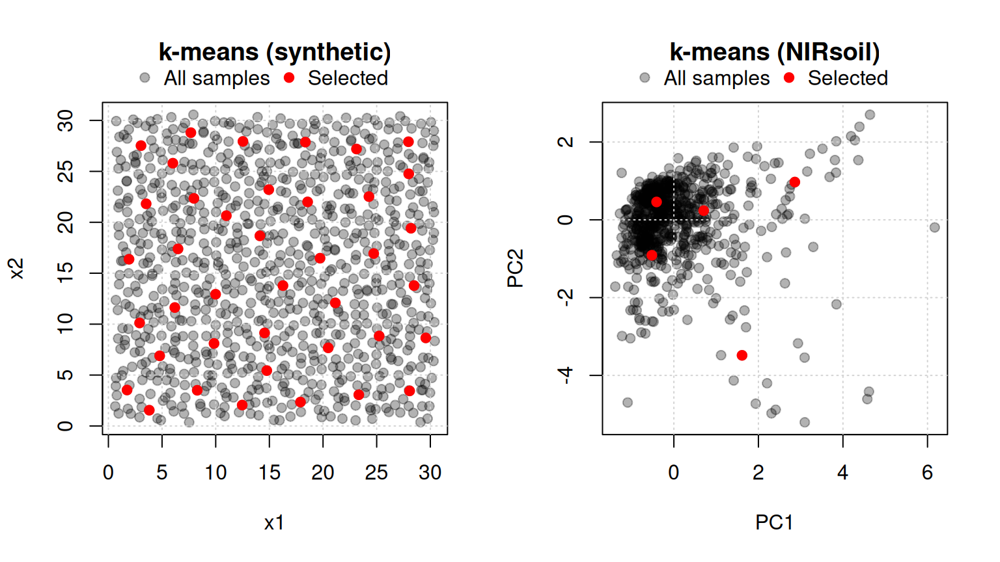
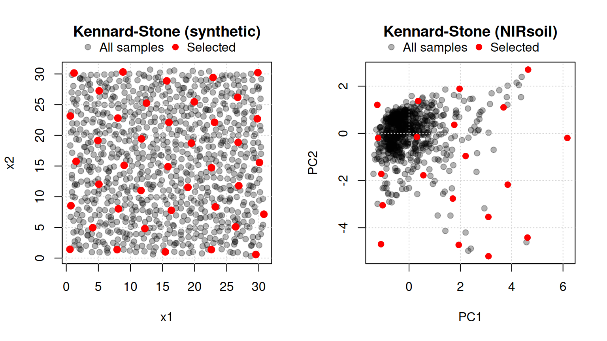
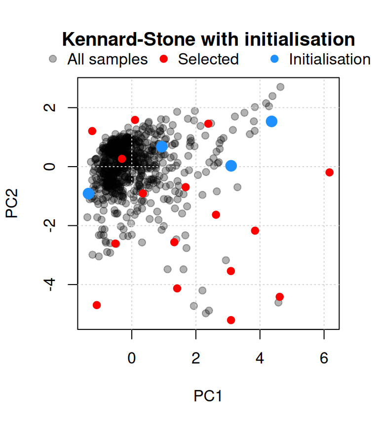
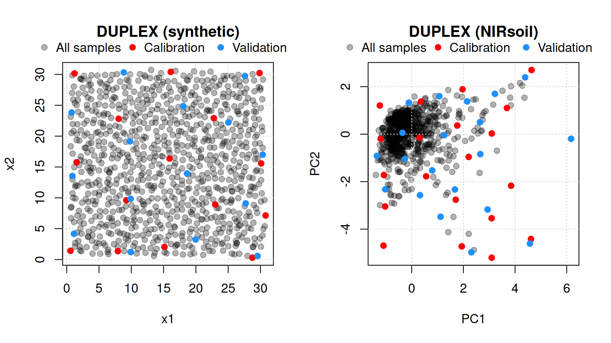
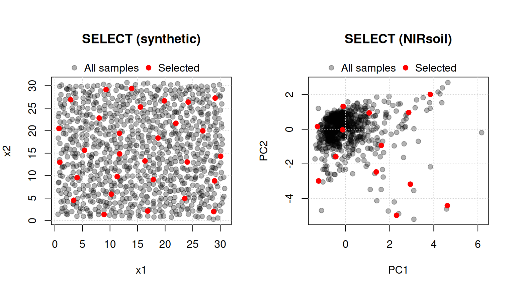
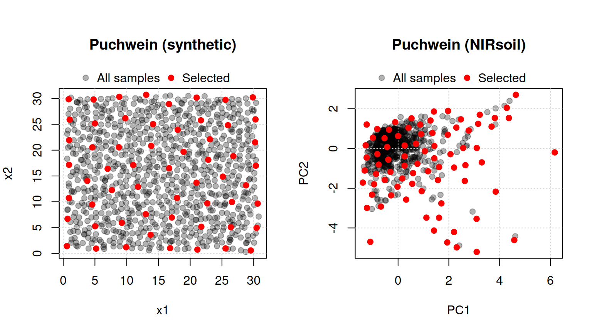
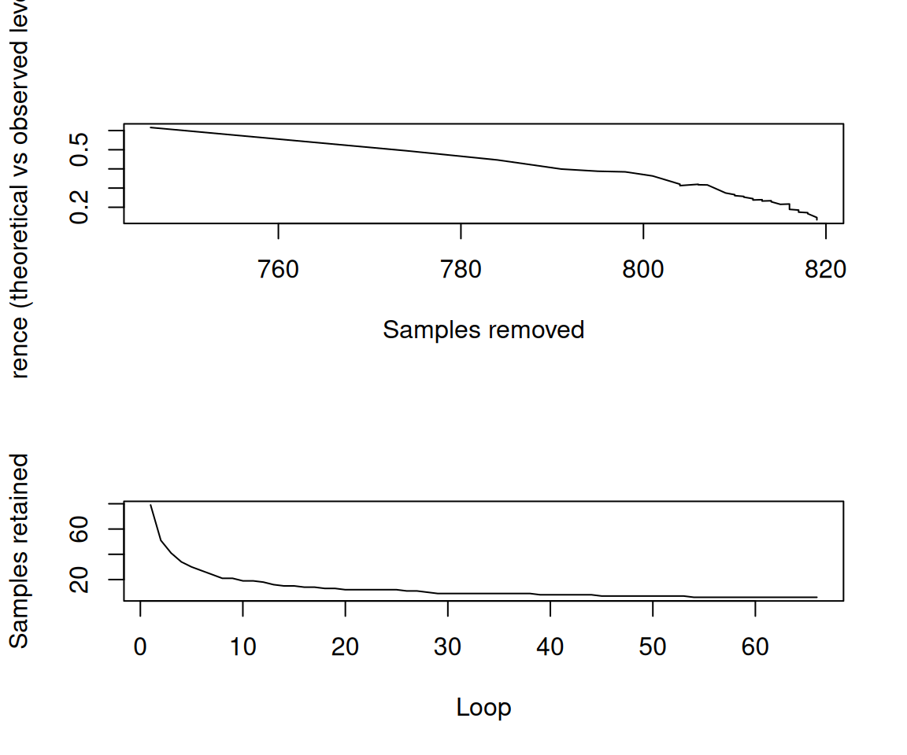
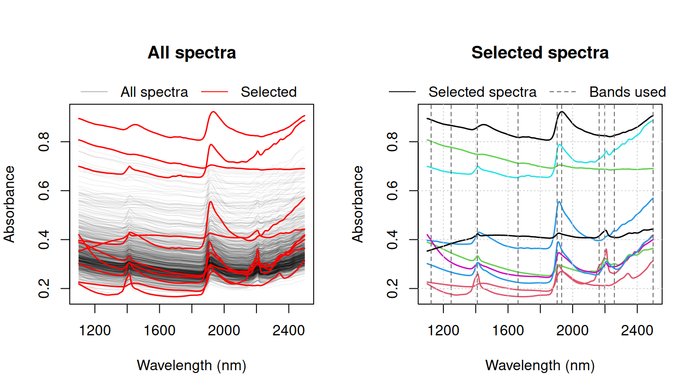

# Selecting representative calibration samples

> *What is the meaning of the adjective representative? Answer: The word
> has no meaning.* – ([Deming, 1986](#ref-deming1986out))


## 1 Introduction

Calibration models are usually developed on a *representative* portion
of the data (training set) and validated on the remaining samples
(test/validation set). There are several approaches for selecting
calibration samples:

- random selection
  (e.g. [`base::sample`](https://rdrr.io/r/base/sample.html))
- stratified random sampling on percentiles of the response $`y`$
- selection based on the spectral data

The `prospectr` package provides functions for the third approach. The
available functions are listed in [Table 1](#tbl-sampling).

| Function | Algorithm |
|:---|:---|
| `naes` | k-means sampling ([Naes et al., 2002](#ref-naes2002)) |
| `kenStone` | Kennard-Stone (CADEX) sampling ([Kennard and Stone, 1969](#ref-kennard1969)) |
| `duplex` | DUPLEX sampling ([Snee, 1977](#ref-snee1977)) |
| `puchwein` | Puchwein sampling ([Puchwein, 1988](#ref-puchwein1988)) |
| `shenkWest` | SELECT algorithm ([Shenk and Westerhaus, 1991](#ref-shenk1991)) |
| `honigs` | Honigs sampling ([Honigs et al., 1985](#ref-honigs1985)) |

Table 1: Calibration sampling functions available in the package.

Here we use the Near-Infrared (NIR) dataset (`NIRsoil`) included in the
package ([Fernandez-Pierna and Dardenne, 2008](#ref-fernandez2008)) to
demonstrate how the calibration sampling functions work:

``` r

library(prospectr)
data(NIRsoil)
# NIRsoil is a data.frame with 825 observations and 5 variables:
# Nt (Total Nitrogen), Ciso (Carbon), CEC (Cation Exchange Capacity),
# train (0/1 indicator for training (1) and validation (0) samples),
# spc (spectral matrix)
str(NIRsoil)
```

    'data.frame':   825 obs. of  5 variables:
     $ Nt   : num  0.3 0.69 0.71 0.85 NA ...
     $ Ciso : num  0.22 NA NA NA 0.9 NA NA 0.6 NA 1.28 ...
     $ CEC  : num  NA NA NA NA NA NA NA NA NA NA ...
     $ train: num  1 1 1 1 1 1 1 1 1 1 ...
     $ spc  : num [1:825, 1:700] 0.339 0.308 0.328 0.364 0.237 ...
      ..- attr(*, "dimnames")=List of 2
      .. ..$ : chr [1:825] "1" "2" "3" "4" ...
      .. ..$ : chr [1:700] "1100" "1102" "1104" "1106" ...

## 2 $`k`$-means sampling (`naes`)

The $`k`$-means sampling algorithm partitions the data into $`n`$
clusters and selects one representative sample per cluster. Formally, to
select a subset of $`n`$ samples
$`X_{tr} = \left\{ {x_{tr}}_j \right\}_{j=1}^{n}`$ from a set of $`N`$
samples $`X = \left\{ x_i \right\}_{i=1}^{N}`$ (where $`N > n`$), the
algorithm proceeds as follows ([Figure 1](#fig-naes)):

1.  Perform $`k`$-means clustering of $`X`$ using $`n`$ clusters.
2.  Extract the $`n`$ centroids $`c`$ (prototypes). Alternatively, the
    selected sample can be the one farthest from the data centre, or a
    random draw within the cluster — see the `method` argument in
    `naes`.
3.  Compute the distance from each sample to each centroid $`c`$.
4.  For each $`c`$, allocate to $`X_{tr}`$ the closest sample in $`X`$.

``` r

# Synthetic grid dataset with jitter
set.seed(1002)
grid_xy <- expand.grid(x1 = 1:30, x2 = 1:30)
X_synthetic <- data.frame(
  x1 = grid_xy$x1 + rnorm(nrow(grid_xy), 0, 0.3),
  x2 = grid_xy$x2 + rnorm(nrow(grid_xy), 0, 0.3)
)
kms_synthetic <- naes(X = X_synthetic, k = 40, iter.max = 100)

# NIRsoil dataset in PC space
kms <- naes(X = NIRsoil$spc, k = 5, pc = 2, iter.max = 100)

par(mfrow = c(1, 2))

plot(
  X_synthetic,
  col = rgb(0, 0, 0, 0.3), pch = 19,
  main = "k-means (synthetic)"
)
grid()
points(X_synthetic[kms_synthetic$model, ], col = "red", pch = 19)
legend(
  x = "top",
  inset = c(0, -0.15),
  xpd = TRUE,
  horiz = TRUE,
  bty = "n",
  legend = c("All samples", "Selected"),
  pch = 19,
  col = c(rgb(0, 0, 0, 0.3), "red"),
  bg = rgb(1, 1, 1, 0.8)
)

plot(
  kms$pc,
  col = rgb(0, 0, 0, 0.3), pch = 19,
  main = "k-means (NIRsoil)"
)
grid()
points(kms$pc[kms$model, ], col = "red", pch = 19)
legend(
  x = "top",
  inset = c(0, -0.15),
  xpd = TRUE,
  horiz = TRUE,
  bty = "n",
  legend = c("All samples", "Selected"),
  pch = 19,
  col = c(rgb(0, 0, 0, 0.3), "red"),
  bg = rgb(1, 1, 1, 0.8)
)

par(mfrow = c(1, 1))
```



Figure 1: Selection of representative samples by k-means sampling on a
synthetic grid dataset (left, $`n = 10`$) and on the NIRsoil dataset in
PC space (right, $`n = 5`$).

## 3 Kennard-Stone sampling (`kenStone`)

To select a subset of $`n`$ samples
$`X_{tr} = \left\{ {x_{tr}}_j \right\}_{j=1}^{n}`$ from a set of $`N`$
samples $`X = \left\{ x_i \right\}_{i=1}^{N}`$ (where $`N > n`$), the
Kennard-Stone algorithm ([Kennard and Stone, 1969](#ref-kennard1969))
proceeds as follows ([Figure 2](#fig-kenstone)):

1.  Find the pair of samples $`{x_{tr}}_1`$ and $`{x_{tr}}_2`$ in $`X`$
    that are farthest apart, allocate them to $`X_{tr}`$, and remove
    them from $`X`$.
2.  Find the sample $`{x_{tr}}_3`$ in $`X`$ with the maximum
    dissimilarity to $`X_{tr}`$, where dissimilarity is defined as the
    minimum distance from any sample already in $`X_{tr}`$. Allocate
    $`{x_{tr}}_3`$ to $`X_{tr}`$ and remove it from $`X`$.
3.  Repeat step 2 a further $`n - 3`$ times to select
    $`{x_{tr}}_4, \ldots, {x_{tr}}_n`$.

The algorithm produces a calibration set with uniform coverage of the
spectral space. The distance metric can be either Euclidean or
Mahalanobis. A known limitation is that the algorithm is prone to
selecting outliers ([Ramirez-Lopez et al., 2014](#ref-ramirez2014));
outlier screening before sample selection is therefore recommended.

``` r

# Synthetic dataset: grid with jitter
grid_xy    <- expand.grid(x1 = 1:30, x2 = 1:30)
set.seed(1014)
X_synthetic <- data.frame(
  x1 = grid_xy$x1 + rnorm(nrow(grid_xy), 0, 0.3),
  x2 = grid_xy$x2 + rnorm(nrow(grid_xy), 0, 0.3)
)
ken <- kenStone(X_synthetic, k = 40)

# NIRsoil dataset — Mahalanobis distance in PC space
ken_mahal <- kenStone(X = NIRsoil$spc, k = 20, metric = "mahal", pc = 2)

par(mfrow = c(1, 2))

plot(
  X_synthetic,
  col = rgb(0, 0, 0, 0.3), pch = 19,
  main = "Kennard-Stone (synthetic)"
)
grid()
points(X_synthetic[ken$model, ], col = "red", pch = 19, cex = 1.2)
legend(
  x = "top",
  inset = c(0, -0.15),
  xpd = TRUE,
  horiz = TRUE,
  bty = "n",
  legend = c("All samples", "Selected"),
  pch = 19,
  col = c(rgb(0, 0, 0, 0.3), "red"),
  bg = rgb(1, 1, 1, 0.8)
)

plot(
  ken_mahal$pc[, 1], ken_mahal$pc[, 2],
  col = rgb(0, 0, 0, 0.3), pch = 19,
  xlab = "PC1", ylab = "PC2",
  main = "Kennard-Stone (NIRsoil)"
)
grid()
points(
  ken_mahal$pc[ken_mahal$model, 1],
  ken_mahal$pc[ken_mahal$model, 2],
  pch = 19, col = "red"
)
legend(
  x = "top",
  inset = c(0, -0.15),
  xpd = TRUE,
  horiz = TRUE,
  bty = "n",
  legend = c("All samples", "Selected"),
  pch = 19,
  col = c(rgb(0, 0, 0, 0.3), "red"),
  bg = rgb(1, 1, 1, 0.8)
)

par(mfrow = c(1, 1))
```



Figure 2: Kennard-Stone sampling on a synthetic two-variable dataset
(left, $`n = 40`$) and on the NIRsoil dataset in Mahalanobis PC space
(right, $`n = 20`$).

When a subset of samples must be included in the calibration set a
priori, the `init` argument allows the algorithm to be initialised with
those indices, incorporating them before the iterative selection begins
([Figure 3](#fig-kenstone-init)).

``` r

initialization_ind <- c(486, 702, 722, 728)
ken_mahal_init <- kenStone(
  X = NIRsoil$spc,
  k = 20,
  metric = "mahal",
  pc = 2,
  init = initialization_ind
)
ken_mahal_init$model
```

     [1] 486 702 722 728 615 619 679 410 614  39 592 617 191 716 613 825 792 611 239
    [20] 640

``` r

plot(
  ken_mahal_init$pc[, 1], ken_mahal_init$pc[, 2],
  col = rgb(0, 0, 0, 0.3), pch = 19,
  xlab = "PC1", ylab = "PC2",
  main = "Kennard-Stone with initialisation"
)
grid()
points(
  ken_mahal_init$pc[ken_mahal_init$model, 1],
  ken_mahal_init$pc[ken_mahal_init$model, 2],
  pch = 19, col = "red"
)
points(
  ken_mahal_init$pc[initialization_ind, 1],
  ken_mahal_init$pc[initialization_ind, 2],
  pch = 19, cex = 1.5, col = "dodgerblue"
)
legend(
  x = "top",
  inset = c(0, -0.15),
  xpd = TRUE,
  horiz = TRUE,
  bty = "n",
  legend = c("All samples", "Selected", "Initialisation"),
  pch = 19,
  col = c(rgb(0, 0, 0, 0.3), "red", "dodgerblue"),
  bg = rgb(1, 1, 1, 0.8)
)
```



Figure 3: Kennard-Stone sampling with 4 forced initialisation samples
(blue) and the remaining selected samples (red) in PC space.

## 4 DUPLEX (`duplex`)

The Kennard-Stone algorithm selects *calibration* samples only. When a
*validation* set is also required, the DUPLEX algorithm ([Snee,
1977](#ref-snee1977)) provides a suitable alternative. It is a
modification of Kennard-Stone that assigns points alternately to the
calibration and validation sets, ensuring both have similar coverage of
the spectral space ([Figure 4](#fig-duplex)).

``` r

dup     <- duplex(X = X_synthetic, k = 15)
dup_nir <- duplex(X = NIRsoil$spc, k = 20, metric = "mahal", pc = 2)

par(mfrow = c(1, 2))

plot(
  X_synthetic,
  col = rgb(0, 0, 0, 0.3), pch = 19,
  main = "DUPLEX (synthetic)"
)
grid()
points(X_synthetic[dup$model, ], col = "red", pch = 19)
points(X_synthetic[dup$test, ],  col = "dodgerblue", pch = 19)
legend(
  x = "top",
  inset = c(0, -0.15),
  xpd = TRUE,
  horiz = TRUE,
  bty = "n",
  legend = c("All samples", "Calibration", "Validation"),
  pch = 19,
  col = c(rgb(0, 0, 0, 0.3), "red", "dodgerblue")
)

plot(
  dup_nir$pc[, 1], dup_nir$pc[, 2],
  col = rgb(0, 0, 0, 0.3), pch = 19,
  xlab = "PC1", ylab = "PC2",
  main = "DUPLEX (NIRsoil)"
)
grid()
points(dup_nir$pc[dup_nir$model, 1], dup_nir$pc[dup_nir$model, 2],
       col = "red", pch = 19)
points(dup_nir$pc[dup_nir$test, 1],  dup_nir$pc[dup_nir$test, 2],
       col = "dodgerblue", pch = 19)
legend(
  x = "top",
  inset = c(0, -0.15),
  xpd = TRUE,
  horiz = TRUE,
  bty = "n",
  legend = c("All samples", "Calibration", "Validation"),
  pch = 19,
  col = c(rgb(0, 0, 0, 0.3), "red", "dodgerblue")
)
par(mfrow = c(1, 1))
```



Figure 4: Selection of 15 calibration and 15 validation samples with the
DUPLEX algorithm on a synthetic grid dataset (left) and on the NIRsoil
dataset in Mahalanobis PC space (right).

## 5 SELECT algorithm (`shenkWest`)

The SELECT algorithm ([Shenk and Westerhaus, 1991](#ref-shenk1991)) is
an iterative procedure that selects the sample with the maximum number
of neighbours within a given distance threshold (`d.min`, default =
0.6), then removes those neighbours from the candidate pool. The number
of selected samples is not fixed in advance but depends on `d.min` and
the density of the data. The distance metric is the Mahalanobis distance
divided by the number of PC dimensions used ([Figure 5](#fig-shenk)).

``` r

shenk_synthetic <- shenkWest(X = X_synthetic, d.min = 0.1)
shenk <- shenkWest(X = NIRsoil$spc, d.min = 0.6, pc = 2)

par(mfrow = c(1, 2), mar = c(5, 4, 6, 2))

plot(
  X_synthetic,
  col = rgb(0, 0, 0, 0.3), pch = 19,
  main = "SELECT (synthetic)"
)
grid()
points(X_synthetic[shenk_synthetic$model, ], col = "red", pch = 19)
legend(
  x = "top",
  inset = c(0, -0.15),
  xpd = TRUE,
  horiz = TRUE,
  bty = "n",
  legend = c("All samples", "Selected"),
  pch = 19,
  col = c(rgb(0, 0, 0, 0.3), "red")
)

plot(
  shenk$pc,
  col = rgb(0, 0, 0, 0.3), pch = 19,
  xlab = "PC1", ylab = "PC2",
  main = "SELECT (NIRsoil)"
)
grid()
points(shenk$pc[shenk$model, ], col = "red", pch = 19)
legend(
  x = "top",
  inset = c(0, -0.15),
  xpd = TRUE,
  horiz = TRUE,
  bty = "n",
  legend = c("All samples", "Selected"),
  pch = 19,
  col = c(rgb(0, 0, 0, 0.3), "red")
)

par(mfrow = c(1, 1))
```



Figure 5: Samples selected by the SELECT algorithm on a synthetic grid
dataset (left, `d.min` = 0.1) and on the NIRsoil dataset in PC space
(right, `d.min` = 0.6).

### 5.1 Puchwein algorithm (`puchwein`)

The Puchwein algorithm ([Puchwein, 1988](#ref-puchwein1988)) produces a
calibration set with uniform coverage of the spectral space. A useful
property is that it allows an objective determination of the required
number of calibration samples through diagnostic plots. The data are
first reduced by PCA and the Mahalanobis distance ($`H`$) from each
sample to the centre of the matrix is computed. Samples are then sorted
in decreasing order of $`H`$ and inter-sample distances in PC space are
computed. The algorithm proceeds as follows ([Figure 6](#fig-puchwein)):

1.  Define a limiting distance.  
2.  Find the sample with $`\max(H)`$.  
3.  Remove all samples within the limiting distance of the selected
    sample.  
4.  Return to step 2 and find the sample with $`\max(H)`$ among the
    remaining samples.  
5.  When no samples remain, return to step 1 and increase the limiting
    distance.

``` r

pu_synthetic <- puchwein(X = X_synthetic, k = 0.2)
pu <- puchwein(X = NIRsoil$spc, k = 0.2, pc = 2)

par(mfrow = c(1, 2), mar = c(5, 4, 6, 2))

plot(
  X_synthetic,
  col = rgb(0, 0, 0, 0.3), pch = 19,
  main = "Puchwein (synthetic)"
)
grid()
points(X_synthetic[pu_synthetic$model, ], col = "red", pch = 19)
legend(
  x = "top",
  inset = c(0, -0.15),
  xpd = TRUE,
  horiz = TRUE,
  bty = "n",
  legend = c("All samples", "Selected"),
  pch = 19,
  col = c(rgb(0, 0, 0, 0.3), "red")
)

plot(
  pu$pc,
  col = rgb(0, 0, 0, 0.3), pch = 19,
  xlab = "PC1", ylab = "PC2",
  main = "Puchwein (NIRsoil)"
)
grid()
points(pu$pc[pu$model, ], col = "red", pch = 19)
legend(
  x = "top",
  inset = c(0, -0.15),
  xpd = TRUE,
  horiz = TRUE,
  bty = "n",
  legend = c("All samples", "Selected"),
  pch = 19,
  col = c(rgb(0, 0, 0, 0.3), "red")
)

par(mfrow = c(1, 1))
```



Figure 6: Samples selected by the Puchwein algorithm on a synthetic grid
dataset (left) and on the NIRsoil dataset in PC space (right).

A distinctive feature of the Puchwein algorithm is the leverage
diagnostic, which helps identify the optimal number of loops (and hence
calibration samples). [Figure 7](#fig-puchwein-leverage) shows the
difference between the theoretical and observed sum of leverages as a
function of samples removed, and the number of samples retained per
loop.

``` r

par(mfrow = c(2, 1))

plot(
  pu$leverage$removed, pu$leverage$diff,
  type = "l",
  xlab = "Samples removed",
  ylab = "Difference (theoretical vs observed leverages)"
)

plot(
  pu$leverage$loop, nrow(NIRsoil) - pu$leverage$removed,
  type = "l",
  xlab = "Loop",
  ylab = "Samples retained"
)

par(mfrow = c(1, 1))
```



Figure 7: Puchwein leverage diagnostics: difference between theoretical
and observed sum of leverages (top) and number of samples retained per
loop (bottom). The first loop is typically optimal.

### 5.2 Honigs sampling (`honigs`)

The Honigs algorithm ([Honigs et al., 1985](#ref-honigs1985)) selects
samples based on the magnitude of their absorption features. It operates
on either absorbance or continuum-removed spectra. The algorithm
proceeds as follows ([Figure 8](#fig-honigs)):

1.  Select the sample with the largest absorption feature (in absolute
    value).
2.  Subtract that absorption from all remaining spectra.
3.  Repeat steps 1–2 until the desired number of samples $`k`$ is
    reached.

``` r

ho  <- honigs(X = NIRsoil$spc, k = 10, type = "A")
wav <- as.numeric(colnames(NIRsoil$spc))

par(mfrow = c(1, 2), mar = c(5, 4, 6, 2))

matplot(
  wav, t(NIRsoil$spc),
  type = "l", lty = 1, lwd = 0.5,
  col = rgb(0, 0, 0, 0.1),
  xlab = "Wavelength (nm)", ylab = "Absorbance",
  main = "All spectra"
)
matlines(wav, t(NIRsoil$spc[ho$model, ]), lty = 1, lwd = 1.5, col = "red")
legend(
  x = "top",
  inset = c(0, -0.15),
  xpd = TRUE,
  horiz = TRUE,
  bty = "n",
  legend = c("All spectra", "Selected"),
  lty = 1,
  col = c(rgb(0, 0, 0, 0.3), "red")
)

matplot(
  wav, t(NIRsoil$spc[ho$model, ]),
  type = "l", lty = 1, lwd = 1.5,
  xlab = "Wavelength (nm)", ylab = "Absorbance",
  main = "Selected spectra"
)
abline(v = wav[ho$bands], lty = 2, col = "grey40")
grid()
legend(
  x = "top",
  inset = c(0, -0.15),
  xpd = TRUE,
  horiz = TRUE,
  bty = "n",
  legend = c("Selected spectra", "Bands used"),
  lty = c(1, 2),
  col = c("black", "grey40")
)

par(mfrow = c(1, 1))
```



Figure 8: All NIRsoil spectra (left) and the 10 samples selected by the
Honigs algorithm with the wavelength bands used during selection marked
(right).

## References

Deming, W.E., 1986. Out of the crisis. MIT Center for Advanced
Engineering Study, Cambridge, MA.

Fernandez-Pierna, J.A., Dardenne, P., 2008. Soil parameter
quantification by NIRS as a chemometric challenge at “chimiométrie
2006.” Chemometrics and intelligent laboratory systems 91, 94–98.

Honigs, D., Hieftje, G.M., Mark, H., Hirschfeld, T., 1985. Unique-sample
selection via near-infrared spectral subtraction. Analytical Chemistry
57, 2299–2303.

Kennard, R.W., Stone, L.A., 1969. Computer aided design of experiments.
Technometrics 11, 137–148.

Naes, T., Isaksson, T., Fearn, T., Davies, T., 2002. Outlier detection.
A user-friendly guide to multivariate calibration and classification.

Puchwein, G., 1988. Selection of calibration samples for near-infrared
spectrometry by factor analysis of spectra. Analytical Chemistry 60,
569–573.

Ramirez-Lopez, L., Schmidt, K., Behrens, T., Van Wesemael, B., Demattê,
J.A., Scholten, T., 2014. Sampling optimal calibration sets in soil
infrared spectroscopy. Geoderma 226, 140–150.

Shenk, J., Westerhaus, M., 1991. Population definition, sample
selection, and calibration procedures for near infrared reflectance
spectroscopy. Crop science 31, 469–474.

Snee, R.D., 1977. Validation of regression models: Methods and examples.
Technometrics 19, 415–428.
