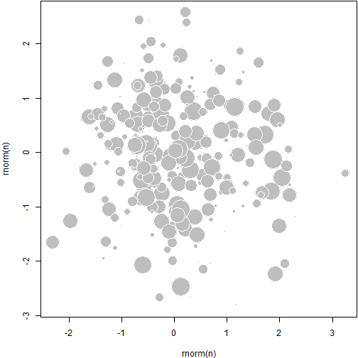

<!--
%\VignetteEngine{knitr}
%\VignetteIndexEntry{An R Markdown Vignette with knitr}
-->

This is an example of Markdown vignettes in R. Before R 3.0.0, only Sweave/PDF vignettes were supported in R. Markdown is gaining popularity over the years due to its simplicity, and R 3.0.0 starts to support package vignettes written in [R Markdown](http://www.rstudio.com/ide/docs/authoring/using_markdown).

## Package vignettes

To enable Markdown vignettes in an R package, you need to

- add `*.Rmd` files under the `inst/doc` or `vignettes` directory
- add `VignetteBuilder: knitr` to the `DESCRIPTION` file
- specify the vignette engine `\VignetteEngine{knitr}` in the `Rmd` files (inside HTML comments)

## View vignettes

And R will load the **knitr** package to build these vignettes to HTML files, and you can see them when you open the HTML help:


```r
help(package = "YourPackage", help_type = "html")
```


## Examples

Below are some code chunks as examples.


```r
cat("_hello_ **markdown**!", "\n")
```

_hello_ **markdown**! 


Normally you do not need any chunk options.


```r
1 + 1
```

```
## [1] 2
```

```r
10:1
```

```
##  [1] 10  9  8  7  6  5  4  3  2  1
```

```r
rnorm(5)^2
```

```
## [1] 1.5133 0.3763 0.5597 0.3296 0.1138
```

```r
strsplit("hello, markdown vignettes", "")
```

```
## [[1]]
##  [1] "h" "e" "l" "l" "o" "," " " "m" "a" "r" "k" "d" "o" "w" "n" " " "v"
## [18] "i" "g" "n" "e" "t" "t" "e" "s"
```


Feel free to draw beautiful plots and write math $P(X>x)=\alpha/2$.


```r
n = 300
set.seed(123)
par(mar = c(4, 4, 0.1, 0.1))
plot(rnorm(n), rnorm(n), pch = 21, cex = 5 * runif(n), col = "white", bg = "gray")
```

 


You can use your own CSS file instead of the built-in style in the **markdown** package -- just set the option `markdown.HTML.stylesheet`, e.g.


```r
options(markdown.HTML.stylesheet = "path/to/a/custom/style.css")
```


For this vignette, I use the `markdown.HTML.header` option to modify a few CSS rules in the default CSS style:


```r
options(markdown.HTML.header = system.file("misc", "vignette.css", package = "knitr"))
```
