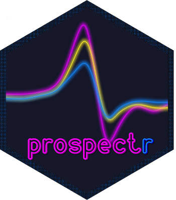

:::: {.columns}
::: {.column width="70%"}
> *In science, one man's noise is another man's signal* -- [@ng1990noise]
:::
::: {.column width="30%"}

:::
::::

# Preamble

`prospectr` provides a set of tools for signal processing and chemometrics,
particularly for the pre-processing and sample selection of spectral data. It is
increasingly used in spectroscopic applications, as reflected by the growing
number of scientific publications citing the package.

Although similar functions are available in other packages, such as
[`signal`](https://CRAN.R-project.org/package=signal), many functions in
`prospectr` are designed to work consistently with `data.frame`, `matrix`, and
`vector` inputs. In addition, several functions are optimised for speed and rely
on C++ code through the [`Rcpp`](https://CRAN.R-project.org/package=Rcpp) and
[`RcppArmadillo`](https://CRAN.R-project.org/package=RcppArmadillo) packages.

# Introduction

Several spectroscopic techniques such as Near-Infrared (NIR) spectroscopy are
high-throughput, non-destructive, and low-cost sensing methods with applications
in agricultural, medical, food, and environmental science. A number of R packages
relevant to spectroscopists are already available for processing and analysis of
spectroscopic data. Since the publication of the
[special volume on Spectroscopy and Chemometrics in R](https://www.jstatsoft.org/issue/view/v018)
[@mullen2007], many spectroscopy-related R packages have been released. Several
are listed in relevant CRAN Task Views, including:

- [Machine Learning & Statistical Learning](https://CRAN.R-project.org/view=MachineLearning)
- [Chemometrics and Computational Physics](https://CRAN.R-project.org/view=ChemPhys)

In addition, [Bryan Hanson](https://github.com/bryanhanson) maintains a curated
list of free and open-source software (FOSS) for spectroscopic applications; see
<https://bryanhanson.github.io/FOSS4Spectroscopy/>.

# Citing the package

If you use `prospectr` in your work, please cite it. The recommended citation
can be obtained in R with:

```{r}
#| message: false
library(prospectr)
```


```{r}
#| label: citation
#| echo: true
citation(package = "prospectr")
```

# Further reading

The functionality of `prospectr` is documented in two additional vignettes:

- **Signal processing**: pre-processing methods including smoothing, derivatives,
  scatter corrections, baseline removal, and resampling.
- **Calibration sampling**: algorithms for selecting representative calibration
  and validation subsets from spectral data.
  